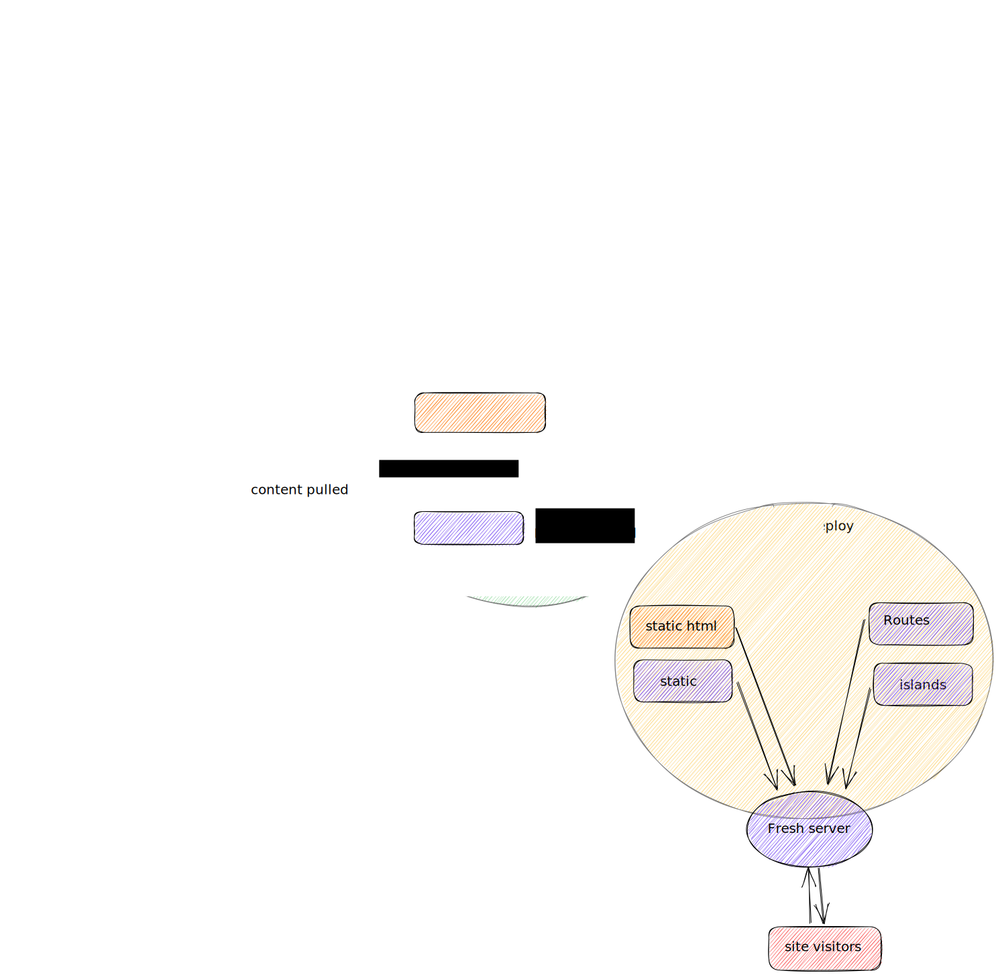

# A Deno Fresh site, integrated with Lume and Directus

### Usage

Start the project:

```
deno task dev
```

This will first generate the Lume static HTML, then serve the Fresh site. Both
the Lume and Fresh sections will be watched and rebuilt/restart as necessary.

### Architecture Diagram


